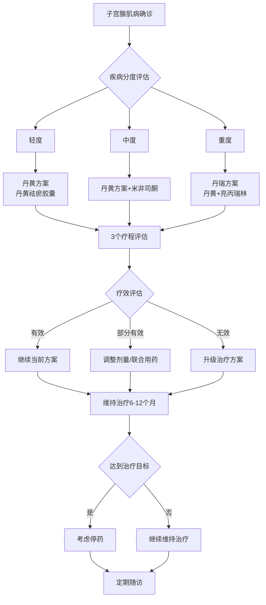

# 丹黄三方案临床决策指南报告

## 一、概述

### 1.1 方案定义
"丹黄三方案"是一种针对子宫腺肌病的中西医结合治疗方案，根据疾病严重程度进行分度治疗。

### 1.2 适应症
- 确诊的子宫腺肌病患者
- 根据疾病严重程度分为轻、中、重三度
- 适用于有保留生育需求或希望避免手术的患者

## 二、各分度治疗方案选择标准

### 2.1 疾病分度标准
根据临床研究，子宫腺肌病分为以下三度：

**轻度子宫腺肌病：**
- 临床症状轻微
- 影像学检查显示病灶局限
- 不影响日常生活

**中度子宫腺肌病：**
- 临床症状明显
- 影像学检查显示病灶较广泛
- 对日常生活有一定影响

**重度子宫腺肌病：**
- 临床症状严重
- 影像学检查显示病灶广泛
- 严重影响日常生活质量

### 2.2 治疗方案选择

**1. 丹黄方案（轻度患者）**
- 适用：轻度子宫腺肌病患者
- 方案：丹黄祛瘀胶囊基础治疗
- 疗程：3个疗程观察周期

**2. 丹黄方案+米非司酮（中度患者）**
- 适用：中度子宫腺肌病患者
- 方案：丹黄祛瘀胶囊联合米非司酮
- 特点：部分患者需追加疗程

**3. 丹瑞方案（重度患者）**
- 适用：重度子宫腺肌病患者
- 方案：丹黄祛瘀胶囊联合亮丙瑞林
- 剂量：丹黄4粒 tid po；瑞林3.75mg ih（首剂经期注射），4周1次
- 效果：可快速降至中度或轻度

## 三、治疗时机把握

### 3.1 初始治疗时机
- 确诊后尽早开始治疗
- 根据症状严重程度选择相应方案
- 月经周期第1-5天开始治疗为佳

### 3.2 治疗调整时机
- 每3个疗程进行评估
- 根据疗效评估结果调整方案
- 症状加重时及时调整治疗方案

## 四、联合用药指征

### 4.1 丹黄祛瘀胶囊联合米非司酮指征
- 中度子宫腺肌病患者
- 单用丹黄方案效果不佳
- 需要加强抗雌激素作用

### 4.2 丹黄祛瘀胶囊联合亮丙瑞林指征
- 重度子宫腺肌病患者
- 需要快速控制症状
- 病灶活性较高需要抑制

### 4.3 联合用药注意事项
- 监测肝肾功能
- 注意药物相互作用
- 定期评估疗效和安全性

## 五、治疗调整依据

### 5.1 疗效评估指标
1. **临床症状改善**
   - 痛经程度减轻
   - 月经量减少
   - 生活质量提高

2. **影像学改善**
   - 子宫体积缩小
   - 病灶范围减小
   - 病灶活性降低

3. **实验室指标**
   - CA125水平下降
   - 炎症指标改善

### 5.2 治疗升级指征
- 当前方案疗效不佳
- 症状加重
- 疾病进展

### 5.3 治疗降级指征
- 症状明显改善
- 影像学显示病灶缩小
- 达到预期治疗目标

## 六、停药和维持治疗决策

### 6.1 停药指征
1. **完全缓解**
   - 症状完全消失
   - 影像学检查正常
   - 维持治疗6-12个月后

2. **治疗无效**
   - 连续2个疗程无改善
   - 出现严重不良反应
   - 患者要求停药

3. **计划妊娠**
   - 准备怀孕前3个月停药
   - 转为妊娠期管理方案

### 6.2 维持治疗决策
1. **维持治疗指征**
   - 症状部分缓解但未完全消失
   - 有复发风险
   - 患者希望巩固疗效

2. **维持治疗方案**
   - 降低药物剂量
   - 延长给药间隔
   - 联合生活方式干预

3. **维持治疗时长**
   - 一般6-12个月
   - 根据复发风险调整
   - 定期评估决定是否继续

## 七、临床决策流程图

## 八、临床实践建议

### 8.1 患者教育
- 解释疾病特点和治疗方案
- 说明治疗预期和可能的不良反应
- 强调定期随访的重要性

### 8.2 监测要求
1. **治疗期间监测**
   - 每月评估症状变化
   - 每3个月影像学检查
   - 定期实验室检查

2. **长期随访**
   - 停药后每6个月随访
   - 关注复发迹象
   - 提供生活方式指导

### 8.3 多学科协作
- 妇科医生主导治疗
- 中医师参与方案制定
- 影像科医生协助评估
- 药师指导用药安全

## 九、参考文献

1. 苏远华等."丹黄三方案"分度治疗轻、中、重度子宫腺肌病的临床研究.遵义医学院学报,2024.
2. 中华中医药学会.子宫腺肌病中西医结合诊疗指南.2023.
3. 丹黄祛瘀胶囊临床应用专家共识.
4. 子宫腺肌病诊治中国专家共识.

## 十、总结

"丹黄三方案"为子宫腺肌病提供了一套完整的分度治疗方案，具有以下特点：

1. **个体化治疗**：根据疾病严重程度选择不同方案
2. **中西医结合**：发挥中医药优势，结合现代医学
3. **疗效明确**：临床研究证实治疗效果显著
4. **安全性好**：不良反应发生率低
5. **操作性强**：临床决策流程清晰，易于实施

本指南为临床医生提供了系统的决策依据，有助于规范子宫腺肌病的治疗，提高治疗效果，改善患者生活质量。